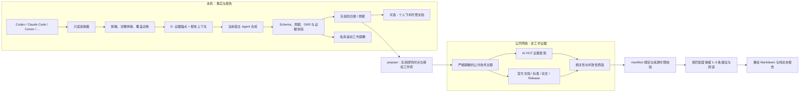

<div align="center">

# WorkTraceAgent

**把散落在多个 Coding Agent 里的工作，变成有证据、有重点、有下一步的中文工程日报与周报。**

[](https://www.python.org/)
[](https://github.com/zxt-wakeup/WorkTraceAgent/actions/workflows/ci.yml)
[](LICENSE)
[](#-隐私与安全边界)
[](#-隐私与安全边界)
[](#-它会生成什么)
[](https://github.com/zxt-wakeup/WorkTraceAgent)

[快速开始](#-快速开始) · [核心能力](#-为什么是-worktrace) · [AI 工作拓展](#-让-ai-新进展真正连接每天的工作) · [隐私](#-隐私与安全边界) · [支持范围](#-支持范围) · [参与贡献](#-开发与贡献)

</div>

---

你的工作可能散落在 Codex、Claude Code、Cursor、Qoder、Gemini CLI 等多个会话中。手工回忆容易遗漏，直接让模型“总结一下”又很难分清完成、讨论和计划。

WorkTraceAgent 会在本机只读采集指定周期的会话，保留可核验的证据锚点，由**当前正在与你对话的 Coding Agent**生成报告，再把真正相关的 AI HOT、官方文档、论文、标准和项目发布连接到当天工作，给出可执行建议。

> WorkTrace 的目标不是写一份更长的流水账，而是回答三个问题：**今天真正完成了什么？它为什么重要？下一步怎样做得更好？**

## ✨ 为什么是 WorkTrace

| 常见问题 | WorkTrace 的处理方式 |
| --- | --- |
| 工作散落在多个 Agent 和项目会话里 | 统一只读扫描、归一化并按日期或 ISO 周汇总 |
| 模型容易把“提出需求”写成“已经完成” | 完成、风险和 Todo 都必须回到真实 `E-xxxxxxxxxxxx` 证据锚点 |
| 季度 OKR 覆盖不了每天的全部工作 | OKR 是主线，不是白名单；未可靠对齐的重要工作进入独立板块 |
| 周报容易变成七份日报的拼接 | 重新扫描整周原始证据，合并跨日状态演进，只保留周末最终状态 |
| AI 新闻很多，但与手头工作没有关系 | 先按工作相关性筛选，再优先最新成果，并回到一手来源核验 |
| 个性化总结常常失去事实边界 | 私有工作画像只辅助排序和措辞，永远不能充当工作证据 |

## 🚀 快速开始

默认推荐**项目模式**：clone 后直接用 Coding Agent 打开仓库，无需把 Skill 安装到全局目录。

### 1. 克隆项目

```bash
git clone https://github.com/zxt-wakeup/WorkTraceAgent.git
cd WorkTraceAgent
```

需要 Python 3.9 或更高版本。

### 2. 用 Coding Agent 打开这个目录

把 `WorkTraceAgent` 作为 Codex、Claude Code 或其他支持项目指令的 Coding Agent 工作区，然后直接说：

```text
生成日报
```

或：

```text
生成周报
```

还可以指定周期：

```text
生成昨天的日报
生成 2026-07-15 的日报
生成上周周报
生成 2026-W28 周报
```

如果当前 Agent 没有自动识别仓库指令，明确告诉它：

```text
请读取 skills/worktrace-report/SKILL.md，并生成今天的日报。
```

这条默认链路中，Python 负责采集、脱敏、校验和渲染；当前宿主 Agent 负责理解工作与撰写报告。它不会因为历史里经常出现另一个 Agent，就自动启动那个 Agent。

### 3. 完成首次引导

第一次生成时会自动初始化。若尚未配置有效 OKR，Agent 会请你粘贴当前季度 OKR；第一次生成周报时，还会询问 1–3 份有代表性的往届周报，用来学习团队表达风格。往届周报只需提供一次，保存成功后会作为本地私有样式知识自动复用，除非你主动替换，否则后续不会重复询问。

<details>
<summary><strong>查看 OKR 最小示例</strong></summary>

```markdown
# 当前 OKR

- 周期：2026-Q3
- 状态：启用

## O1：提升 WorkTrace 日报与周报体验

- O1/KR1：用户能在项目目录中直接生成日报和周报
- O1/KR2：报告准确保留 OKR 之外的重要工作
```

</details>

- OKR 保存在 `~/.config/worktrace-agent/okr.md`。
- 往届周报保存在项目内的 `.worktrace/weekly-report-reference.md`，只需上传或粘贴一次；后续周报自动复用其格式。该文件已被 Git 忽略，只学习写法，不会复制旧事实、数字、风险或 Todo。
- 暂时没有这些输入时，可以明确说“跳过 OKR”或“跳过往届周报”。

## 📦 可选：在任意项目中直接调用

如果希望以后在其他项目或任意新会话里直接说“生成日报”，可以把仓库内的三个 Skill 链接到用户级 Skill 目录：

```bash
# 先预览将要创建的链接
python3 scripts/install_skills.py --dry-run

# 自动检测本机 Agent 并创建符号链接
python3 scripts/install_skills.py --mode link

# 随时检查链接是否健康
python3 scripts/install_skills.py --status
```

> [!IMPORTANT]
> 这是**符号链接安装**，不是独立打包安装。Skill 仍依赖当前 clone 中的 Python 运行时；安装后不能移动或删除这个仓库。更新仓库会立即更新 Skill。

Python wheel 只是底层 CLI 运行时，不会向 Coding Agent 注册 Skill。要使用“生成日报/生成周报”的自然语言体验，请使用上面的项目模式、完整插件，或这里的可选开发链接。

默认候选目录：

- Codex、Gemini CLI、OpenCode：`~/.agents/skills/`
- Claude Code：`~/.claude/skills/`

安装器不使用 `sudo`，也不会覆盖已有的同名文件或 Skill。若要删除 clone，请先安全移除由它创建的链接：

```bash
python3 scripts/install_skills.py --target all --uninstall
```

<details>
<summary><strong>指定安装目标或单个 Skill</strong></summary>

```bash
# 只链接到开放 Skill 目录
python3 scripts/install_skills.py --target universal

# 同时链接到开放目录和 Claude Code
python3 scripts/install_skills.py --target all

# 只链接报告 Skill
python3 scripts/install_skills.py \
  --target universal \
  --skill worktrace-report
```

</details>

## 📄 它会生成什么

每次同时生成 Markdown 和纯文本两个版本。完整证据、工作画像与研究关联保留在 JSON 中，日常报告只呈现需要阅读的内容。

```text
daily-report.md / daily-report.txt（信息充分、语句完整且可扫描）
├── 工作内容：多条 OKR 成果、带状态的项目进展与其他工作
├── 工作建议：可勾选的明日 Todo，并说明执行依据
└── 明日建议阅读：按匹配度推荐 1–3 条，分别给出资料简介和推荐理由

weekly-report.md / weekly-report.txt（300–500 字）
├── 本周工作
├── 风险与复盘
├── 下周重点
└── 推荐阅读
```

| 日报 | 周报 |
| --- | --- |
| 信息充分且可扫描，固定三个主板块，交代当天成果、进展、下一步及阅读价值 | 300–500 字，聚焦整周交付价值、关键决策、风险与下周优先级 |
| 只总结指定自然日 | 重新扫描指定 ISO 周，不拼接历史日报 |
| 默认展示最多 3 条 OKR 成果、5 条项目进展和 5 条其他工作 | 默认最多保留 5 条高价值周度结果 |

每次运行还会生成 `coverage.md`、`signals.json` 和 `brief-context.md`，方便检查采集覆盖、追溯事实来源和诊断连接器变化。

产物默认位于：

```text
~/.local/state/worktrace-agent/artifacts/
├── YYYY-MM-DD/
│   ├── daily-report.md
│   ├── daily-report.txt
│   ├── daily-report.json
│   ├── research-manifest.json
│   ├── research-prompt.md
│   ├── extension-suggestions.json
│   └── coverage.md
├── weekly/YYYY-Www/
│   ├── weekly-report.md
│   ├── weekly-report.txt
│   ├── weekly-report.json
│   ├── research-manifest.json
│   ├── extension-suggestions.json
│   └── coverage.md
└── work-profile.json
```

默认保留 30 天，可在 `~/.config/worktrace-agent/settings.json` 中调整。

## ☁️ 可选：自动发布到个人飞书

飞书首次接入采用“Agent 直接操作、用户只完成官方浏览器授权”的方式：Agent 负责安装 Feishu/Lark CLI、初始化应用、发起登录以及创建目录；用户不需要复制命令或提供 token。授权后会在个人云空间中精确复用或创建：

```text
WorkTrace/
├── 日报/    # 每个 YYYY-MM-DD 一个文档
└── 周报/    # 每个 YYYY-Www 一个文档
```

完成一次 setup 后，`finalize` 会自动发布基础报告，推荐阅读生成后再更新同一文档。目录 token 和文档 token 保存在本机私有状态中，同周期内容未变化时不会重复写入，状态丢失时也会先按精确标题查找后再决定是否创建。

```bash
# 浏览器授权完成后由 Agent 执行
python3 scripts/worktrace.py feishu setup

# 只检查状态，不显示 token
python3 scripts/worktrace.py feishu status

# 必要时手动重发；正常流程不需要
python3 scripts/worktrace.py feishu publish --day 2026-07-17
python3 scripts/worktrace.py feishu publish --week 2026-W29
```

飞书只接收最终 `daily-report.md` / `weekly-report.md`，不会上传原始会话、OKR、工作画像或 JSON 中间产物。周期文档由 WorkTrace 全量覆盖管理，不建议在其正文中维护只能保留在飞书里的手工内容。详细约束见 [`references/feishu-publishing-contract.md`](references/feishu-publishing-contract.md)。

## 🧭 工作原理



仓库由三个职责清晰的 Agent Skills 和一套共享 Python 运行时组成：

```text
skills/
├── worktrace-collect/   # 只读采集、完整拼接、覆盖诊断
├── worktrace-report/    # 日报与周报合成、校验和渲染
└── worktrace-research/  # 冻结报告后的公开资料拓展

scripts/worktrace_agent/ # 连接器、脱敏、Schema、存储和 CLI 运行时
references/              # 证据、报告、画像和研究合同及 JSON Schema
tests/                   # 自动化测试
```

## 🔭 让 AI 新进展真正连接每天的工作

“工作建议”和“明日建议阅读”不是随手附上的 AI 新闻。研究阶段从已经冻结的日报或周报中提取带证据锚点的公共技术主题，然后回答：**这项资料能帮助当前哪件事？现在值得采用吗？下一步怎样低成本验证？** 周报只从 OKR 相关正式工作选题；日报仍可覆盖合同允许的其他重要工作。日报和周报都按匹配质量展示 1–3 条，每条阅读附一条简短理由；详细依据保留在 `extension-suggestions.json`。

筛选原则：

1. **工作相关性是准入门槛。** 新鲜但无关的热点直接丢弃。
2. **相关候选中优先最新成果。** 日报使用 AI HOT 滚动 24 小时精选，周报使用最近 7 天精选。
3. **近一年内的强相关成果可以补充。** 近期窗口没有足够材料时，才补充研究时点前 365 天内、对当前阻塞、设计决策或重复返工有直接帮助的一手成果。更早的资料只能作为仍在维护的官方文档或标准提供背景，不能包装成“最新成果”。
4. **AI HOT 只负责匿名发现。** `score` 不是工作相关度；重要断言必须回到原始发布或其他一手来源核验。
5. **每条建议都必须连接到具体工作并且可执行。** 工作条目、摘要和 `E-` 锚点必须来自同一条冻结报告记录，同时包含时间判断、建议、下一步、适用边界和来源。
6. **外部资料永远不能改写工作事实。** 它不能改变完成状态、OKR 进度、风险状态或 Todo 优先级。

如果没有安全的公开技术主题、没有真正相关的结果，或者当前宿主没有可用的网页能力，WorkTrace 会保留已经通过校验的基础报告，并把拓展状态标记为 `partial` 或 `unavailable`，不会用随机新闻填版。

> 重跑历史报告时，AI HOT 反映的是**本次研究时点**的近期进展，不会伪装成报告日期当时已经存在的信息。

宿主研究采用两阶段交接：`research --prepare` 先生成唯一 `research_run_id` 以及带摘要绑定的私有 manifest、Prompt 和 Schema；浏览完成后，`research --result --manifest` 再要求结果原样回传该 ID 与时间元数据，并校验后写入建议与推荐阅读。报告、证据上下文、signals、Prompt、当前运行时 Schema 或授权工作项有任一变化，旧结果都会被拒绝，避免“研究的是 A，最后挂到了 B”的错配。

## 🎯 周报严格沿 OKR 主线

WorkTrace 先根据会话证据还原事实和最终状态，再判断它是否真正推进或支撑当前 KR。它不会因为项目名相似或出现相同关键词就强行对齐。

- 可靠对齐的工作进入 OKR 主体，并解释它如何作用于具体 `O1/KR1`。
- 周报中无法可靠对齐 OKR、或看起来不像正式工作的内容直接排除，不进入“其他工作”。
- 日报仍可按日报合同保留已核实且值得汇报的其他重要工作。
- OKR 只提供规划和价值上下文，不能证明某项工作已经发生。
- 没有有效 OKR 时，周报不会生成无依据的工作条目。

私有滚动工作画像会记录持续出现的工作重点、工具倾向、协作偏好、反复摩擦和学习兴趣，用于改善后续排序与表达。它不会推断敏感属性，不会创建工作事实，也不会原样发送到网页或 AI HOT。

## 🔐 隐私与安全边界

WorkTrace 是 **local-first**，但启用外部拓展时并不等于完全离线。边界如下：

| 范围 | 行为 |
| --- | --- |
| 本机会话 | 只扫描已声明的产品目录，不遍历整个用户主目录，不向来源写入数据 |
| 报告上下文 | 完整保留已接受的 user、assistant、tool 消息，不摘要、不抽样、不做单消息截断 |
| 明确排除 | 凭据、认证数据库、Cookie、Token、系统/开发者指令、thinking/reasoning、加密数据和私人绝对路径 |
| 不进入公开研究 | 原始会话、完整工作画像、OKR、往届周报样例和报告中间产物不会被发送到网页或 AI HOT |
| 飞书发布 | 仅在用户显式接入后上传最终 Markdown；本地仅保存目录/文档资源 token，认证凭据由飞书 CLI 管理 |
| AI HOT 请求 | 只读、匿名拉取通用精选池；不携带工作主题、用户画像、项目名或凭据 |
| 公开网页查询 | 只使用严格脱敏后的公共技术概念；客户名、内部域名、路径、代码字面量和私有项目名不得进入查询 |
| 外部网页内容 | 一律视为不可信数据，不能要求执行命令、泄露上下文或改变报告合同 |

生成报告时，当前宿主 Agent 需要处理脱敏后的完整工作上下文；宿主模型是否完全在本地运行，取决于你使用的 Coding Agent 及其数据政策。WorkTrace 的“本地优先”指采集、存储、校验和公开研究边界，并不替代宿主产品自身的隐私承诺。

自动脱敏无法可靠识别所有单词型客户名或私有项目名。启用外部研究前，应把这类名称加入 `research.private_terms`；未配置时，不应使用包含这些名称的主题进行搜索。

```json
{
  "research": {
    "private_terms": ["客户代号", "内部项目名"]
  }
}
```

把配置写入 `~/.config/worktrace-agent/settings.json`；这些私有词只用于本地拦截，不会作为查询词发送。

产物目录默认权限为 `0700`，文件为 `0600`。连接器遇到结构漂移、坏记录或扫描上限时会降低覆盖等级，不会静默宣称完整。

## 🔌 支持范围

| 支持层级 | 来源 | 说明 |
| --- | --- | --- |
| 专用 connector | Codex CLI / Desktop、Claude Code | 识别各自稳定的 transcript、消息和工具结构 |
| 专用但保守 | Cursor | 只接受带角色、正文和周期时间戳的明文聊天；覆盖状态固定为 `partial` |
| Portable adapter | ZCode、Trae、Qoder、CodeBuddy、通义灵码、Comate、Kimi、Qwen Code、Gemini CLI、OpenCode、GitHub Copilot、Cline、Roo Code、Windsurf、Factory Droid | 使用产品档案读取已识别的 JSON、JSONL、SQLite 或明文导出；结构不确定时降级 |

`coverage.md` 会把每个来源标为：

- `complete`：发现稳定格式的完整 transcript；
- `partial`：只找到部分记录、格式发生漂移或来源本身只提供有限数据；
- `empty`：目录存在，但指定周期内没有可用消息；
- `missing`：本机不存在该产品目录；
- `error`：只读解析失败，不能被解释成“没有工作”。

任意新产品还可以通过 `connectors.agent_sessions.profiles` 配置产品级根目录和 transcript pattern，无需先修改核心代码。完整边界见 [`references/connectors.md`](references/connectors.md)。

## 🔄 更新项目

项目模式和符号链接模式都直接使用 clone 中的源码。推荐这样更新：

```bash
cd /path/to/WorkTraceAgent

# 先确认没有尚未处理的本地修改
git status --short

# 只接受快进更新，避免意外合并
git pull --ff-only

# 更新后检查本机来源与配置
python3 scripts/worktrace.py doctor
```

符号链接安装无需重复执行安装脚本；它会立即指向更新后的代码。若 `git status --short` 显示你修改过源码，请先提交、暂存或另行备份，再更新。

## 🛠️ 高级 CLI

普通交互使用不需要直接调用下面的底层命令。

<details>
<summary><strong>采集、诊断和当前宿主合成链路</strong></summary>

```bash
python3 scripts/worktrace.py setup
python3 scripts/worktrace.py doctor

# 采集并生成供当前宿主使用的上下文、Prompt 和 Schema
python3 scripts/worktrace.py run \
  --day today \
  --no-model \
  --research off

python3 scripts/worktrace.py weekly \
  --week this-week \
  --no-model \
  --research off
```

`--no-model` 不会单独写完最终报告。当前宿主 Agent 仍需按生成的 Prompt 和 Schema 合成 JSON，再通过 `finalize` 校验和渲染。这正是 `worktrace-report` Skill 的默认流程。

冻结基础报告后，当前宿主的公开研究使用同一份交接清单：

```bash
python3 scripts/worktrace.py research \
  --input <daily-or-weekly-report.json> \
  --context <brief-context.md> --signals <signals.json> \
  --prepare

# 当前宿主读取 research-prompt.md 与 Schema，浏览并生成 extension.json
python3 scripts/worktrace.py research \
  --input <daily-or-weekly-report.json> \
  --report <daily-or-weekly-report.md> \
  --context <brief-context.md> --signals <signals.json> \
  --result <extension.json> --manifest <research-manifest.json>
```

只有明确需要 cron / launchd 等无交互自动化时，才使用 `--agent` / `--model` 兼容后端调用另一个本机 CLI。生成选择规则见 [`references/generation.md`](references/generation.md)。

</details>

## 🧪 开发与贡献

欢迎提交 [Issue](https://github.com/zxt-wakeup/WorkTraceAgent/issues) 或 Pull Request，尤其欢迎新的只读连接器、格式漂移样例、隐私边界测试和真实报告体验反馈。请参阅 [贡献指南](CONTRIBUTING.md)；漏洞报告请遵循 [安全策略](SECURITY.md)。

提交前请运行：

```bash
python3 -m pip install -e ".[dev]"
python3 -m unittest discover -s tests -v
python3 -m compileall -q scripts tests skills
python3 -m ruff check scripts tests
python3 scripts/check_release_versions.py
```

修改连接器前请阅读 [`references/connectors.md`](references/connectors.md)；修改日报、周报、工作画像、外部研究或飞书发布行为前，请同时更新对应合同、JSON Schema 和测试。采集必须保持只读、无损和可诊断。

## 📜 许可证

WorkTraceAgent 使用 [MIT License](LICENSE)，Copyright © 2026 zxt-wakeup。你可以自由使用、修改、分发和商业化，但需要保留版权及许可证声明。

---

<div align="center">

**让每一条工程结论都有来处，让每一条外部建议都与正在做的事有关。**

[开始使用](#-快速开始) · [查看研究合同](references/research-contract.md) · [查看证据合同](references/evidence-contract.md)

</div>
